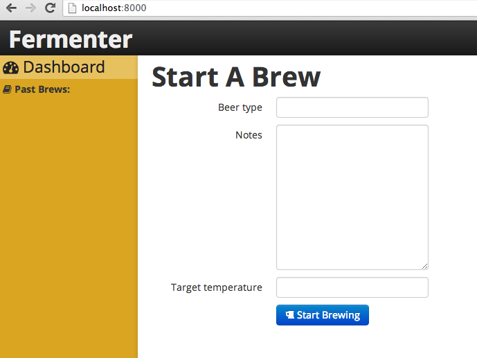

Fermenter
=========

A Raspberry Pi powered fermentation chamber for brewing beer with a simple and slick web interface.

## Long Installation Instructions ##

These are the instructions for setting up the app if you're starting from a stock Rasbian Wheezy Linux install.
To find out how to install Rasbian Wheezy refer to the instructions on http://www.raspberrypi.org/downloads

### Install OS packages: ###

    sudo apt-get install vim python-dev python-setuptools nginx supervisor git
    sudo easy_install pip
    sudo pip install virtualenv virtualenvwrapper
    echo "source /usr/local/bin/virtualenvwrapper.sh" >> ~/.bashrc
    source /usr/local/bin/virtualenvwrapper.sh

### Install Fermenter Web Application ###

    cd ~
    mkvirtualenv fermenter
    git clone https://github.com/mfwarren/Fermenter.git
    cd Fermenter
    pip install -r requirements.txt
    ./manage.py syncdb
    ./manage.py migrate
    ./manage.py runserver 0.0.0.0:8000

Test that the webserver is working on port 8000 before proceeding, Ctrl-C to stop server once confirmed.

### Configure Http Server ###

I'm using nginx infront of gunicorn (managed by supervisord). The config files are included.

    sudo bash setup/install.sh

### Optional Steps: ###

Set hostname on raspberry pi:

    sudo vim /etc/hostname
    sudo vim /etc/hosts

Replace 'raspberrypi' with 'fermenter' in both files.

-------

Set a static IP:

    sudo vim /etc/network/interfaces

Remove the existing eth0 line and add these:

    iface eth0 inet static
    address 192.168.1.222
    netmask 255.255.255.0
    gateway 192.168.1.1

Point to this static IP address in your hosts file so that you can connect to fermenter.local rather than 192.168.1.??

### Finish ###

Reboot

    sudo reboot

## Quick Installation ##

SD card disk image for the Raspberry Pi with everything configured is coming soon...
